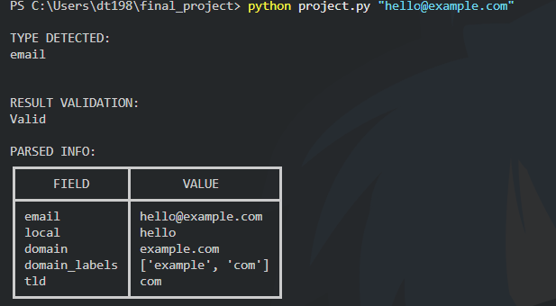
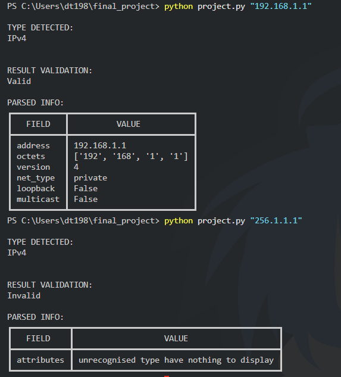
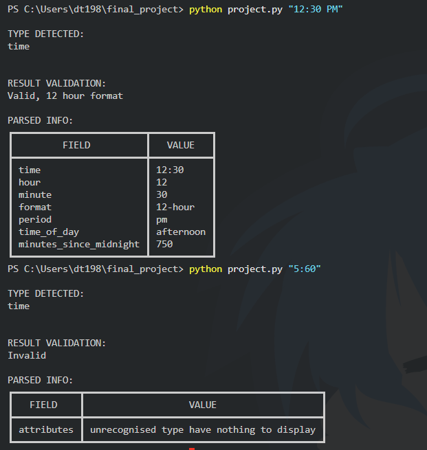
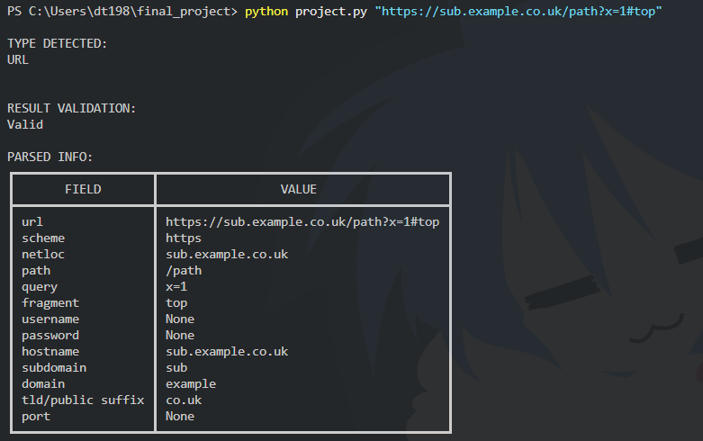
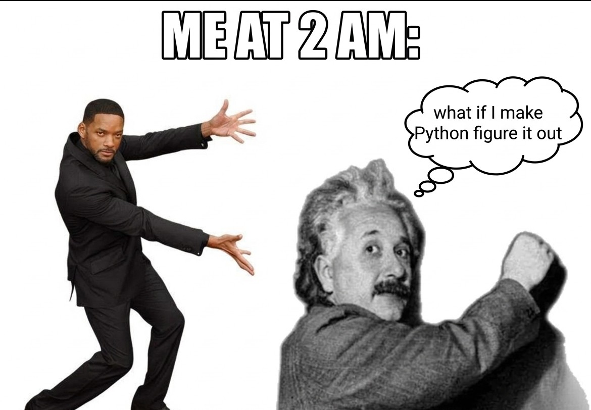

# Kumakun: A CLI Detector & Parser

#### Description:

Kumakun is a command-line utility written in Python that accepts different kinds of input, detects what the input appears to represent, validates it using stricter rules, extracts useful information from it, and presents the result in a structured format.

I built Kumakun as my final project for my 60-day python venture. I wanted to make something which I could not have made on my own on day-1. The project grew from my interest in regular expressions, parsing, command-line programs, and the question of how a program can determine what an arbitrary piece of input represents.

Rather than building several unrelated features, I decided to focus on one problem: **understanding input**.

The name **Kumakun** comes from the Japanese word *kuma* (くま), meaning "bear." The "-kun" suffix gives the name a friendly, informal character. I chose the name because I imagined Kumakun as a little bear that searches through unfamiliar input, digs into its structure, and brings useful information back to the user.

The central pipeline of Kumakun is:

```text
INPUT
  ↓
DETECTION
  ↓
VALIDATION
  ↓
PARSING
  ↓
DISPLAY
```

Each stage has a separate responsibility.


**Detection** asks:

> "What does this input look like?"

Detection is intentionally broad. It does not attempt to completely prove that an input is valid. For example, something shaped like an IPv4 address can be detected as an IPv4 candidate even if its values are impossible for a real IPv4 address.

**Validation** asks:

> "Is it actually valid?"

This stage applies stricter rules appropriate to the detected type. For example, `256.1.1.1` resembles an IPv4 address, but it is rejected because an IPv4 octet cannot be greater than 255.

**Parsing** asks:

> "What useful information can I extract from this?"

After successful validation, Kumakun breaks the input into meaningful components and derives additional information where appropriate.

Finally, **Display** presents the parsed information in a structured table in the terminal.

---

## Supported Input Types

Kumakun currently supports four main input types:

* Email addresses
* IPv4 addresses
* Time
* HTTP/HTTPS URLs

The interesting part is not simply recognizing these formats. Each type has its own validation rules and edge cases.

---

### Email

Kumakun first detects input that resembles an email address and then applies a stricter regular expression for validation.

For a valid email address, it extracts:

* the complete email address
* local part
* domain
* individual domain labels
* top-level domain

For example:

```text
hello@sub.example.com
```

can be broken down into its local part, domain, domain labels, and TLD.

The validator also distinguishes between inputs that merely contain an `@` and inputs that satisfy the project's email validation rules. For example, an address-like input without a valid domain structure is rejected.



---

### IPv4

Kumakun detects dotted numeric input as an IPv4 candidate and uses Python's `ipaddress` module for strict validation.

For a valid IPv4 address, it extracts:

* the address
* individual octets
* IP version
* network classification
* whether the address is a loopback address
* whether the address is multicast

This allows Kumakun to distinguish between an input that merely resembles an IPv4 address and an actual valid IPv4 address.

For example:

```text
256.1.1.1
```

looks like an IPv4 address structurally, but is rejected during validation.

Other malformed cases are also tested, including:

```text
01.2.3.4
192..1.1
hello.1.2.3
```

The validator therefore does more than simply count four groups separated by periods.



---

### Time

Kumakun accepts both 12-hour and 24-hour time formats.

Supported forms include:

```text
HH:MM
H:MM
HH:MM am/pm
H:MM am/pm
HH am/pm
H am/pm
HHam/pm
Ham/pm
```

The hour component may contain one or two digits where appropriate. The parser also accepts different capitalization of the AM/PM marker because time detection and validation are case-insensitive.

For example, inputs such as:

```text
5:20
05:20
12:20 PM
5 PM
05 pm
```

can represent supported time formats.

For a valid time, Kumakun determines:

* hour
* minute
* format
* AM/PM period when applicable
* time of day
* minutes since midnight

A 12-hour time is converted internally to a 24-hour representation when calculating values such as minutes since midnight, while the original format is still represented in the parsed result.

Time validation also handles boundary cases. Examples of invalid input include:

```text
5:60
0:30 AM
25:30
13:30 AM
5:20 XM
5:20 AM PM
abc:20
```

This was one of the areas where separating detection from validation became especially useful. A value can look like a time without actually representing a valid time.



---

### URL

Kumakun supports HTTP and HTTPS URLs.

URLs are first detected using a broad pattern and then validated more strictly. The validator checks factors including:

* HTTP/HTTPS scheme
* presence of a network location
* absence of whitespace
* hostname structure
* hostname label length
* invalid leading or trailing hyphens
* valid domain-label structure
* valid IPv4 hosts
* localhost

For a valid URL, Kumakun extracts:

* URL
* scheme
* network location
* path
* query
* fragment
* username
* password
* hostname
* port
* subdomain
* domain
* top-level/public suffix

For example:

```text
https://sub.example.co.uk/path?x=1#top
```

contains substantially more structure than just a hostname, and Kumakun exposes that structure in its parsed output.

The `tldextract` package is used so that multi-label public suffixes such as `co.uk` can be handled correctly.

URL edge cases are also explicitly tested. Examples include:

```text
https://
https://.com
https://example.
https://.example.com
https://example..com
https://-example.com
ftp://example.com
file:///home/user/test.txt
mailto:user@example.com
```

These cases demonstrate why simply using `urlsplit()` is not enough to decide whether a URL should be considered valid.



---

## Detection, Validation, and Parsing

One of the main design decisions in Kumakun was keeping detection and validation separate.

The project follows the idea:

```text
"Does it look like X?"
        ↓
"Is it actually X?"
        ↓
"What can I learn from X?"
```

This distinction is important because pattern recognition and validation are not the same problem.

For example:

```text
123.456.789.000
```

has the shape of an IPv4 address, so it can be detected as an IPv4 candidate. However, validation rejects it because its octets are outside the valid IPv4 range.

The same principle applies to time and URLs. Detection tries to identify what the input resembles, while validation applies the rules specific to that type.

This also gives the program a predictable pipeline:

```text
INPUT
  ↓
DETECT
  ↓
VALIDATE
  ↓
PARSE
  ↓
DISPLAY
```

If the input cannot be recognized or does not pass validation, Kumakun does not attempt to extract meaningful parsed information from it.

---

## Handling Edge Cases

A significant part of this project was discovering that parsing seemingly simple formats is not actually simple.

A parser cannot only be tested with:

```text
hello@example.com
192.168.1.1
12:30
https://example.com
```

It also needs to deal with inputs that are almost correct, structurally misleading, malformed, or valid only under specific rules.

For example, the test suite checks cases such as:

* malformed email addresses
* email addresses with unusual characters
* domains without a valid suffix
* IPv4 addresses containing values above 255
* IPv4 addresses with leading-zero octets
* incorrectly formatted IPv4 addresses
* times with invalid minutes
* impossible 12-hour values
* impossible 24-hour values
* incorrect or repeated AM/PM markers
* unsupported URL schemes
* missing hostnames
* empty domain labels
* domains beginning or ending with `-`
* repeated dots in hostnames
* nested subdomains
* URLs containing paths, queries, fragments, and ports
* localhost URLs
* IPv4-based URLs

Testing these cases helped me realize that the difficult part of a parser is often not recognizing the obvious examples, but deciding what should happen when the input is **almost** correct.

---

## Design

I designed `main()` primarily as the conductor of the program rather than putting all of the logic into one large function.

The main flow is:

```text
main()
  │
  ├── detect()
  │
  ├── validate()
  │      ├── validate_email()
  │      ├── validate_ipv4()
  │      ├── validate_time()
  │      └── validate_url()
  │
  ├── parser()
  │      ├── parse_email()
  │      ├── parse_ipv4()
  │      ├── parse_time()
  │      └── parse_url()
  │
  └── display()
```

This separation makes each function responsible for one main task and makes individual pieces easier to test.

Regular expressions are used where pattern recognition is useful, while Python's standard library is used where it provides stronger validation or parsing functionality.

For example, `ipaddress` handles IPv4 validation instead of attempting to reproduce all IPv4 rules manually.

Similarly, `urllib.parse` provides the basic URL decomposition, while additional validation is performed by Kumakun.

I also used small classes where an object naturally represented information that needed to move between stages. The `URL` class stores components of a parsed URL, while the `Time` class stores information about a validated time.

I deliberately did not turn the entire project into an object-oriented system simply because I had learned OOP. I used classes where they made the design clearer and kept the rest of the program procedural where that was more appropriate.




---

## Project Files

### `project.py`

Contains the implementation of Kumakun.

The main components include:

* `main()` — coordinates the overall program flow
* `detect()` — determines the likely input type
* `validate()` — routes the input to the appropriate validator
* individual validation functions for email, IPv4, time, and URL
* `parser()` — routes validated input to the appropriate parser
* individual parsing functions for each supported input type
* `display()` — presents the final result in the terminal
* `URL` and `Time` classes for structured data

### `test_project.py`

Contains the automated tests for Kumakun using `pytest`.

The tests cover the detector and validators across valid inputs, invalid inputs, boundary cases, malformed inputs, and inputs that resemble a supported type without actually being valid.

The test suite includes cases for:

* email detection and validation
* IPv4 detection and validation
* time detection and validation
* URL detection and validation
* malformed and unsupported input
* boundary values
* URL paths, queries, fragments, ports, and subdomains

Testing became an important part of the project because I wanted to repeatedly ask:

> "What could go wrong? Where?"

The tests are therefore not limited to checking that the obvious examples work. They also test inputs that are plausible enough to expose weaknesses in detection and validation logic.

### `requirements.txt`

Lists the third-party Python packages required by the project.

```text
tabulate
tldextract
```

Python standard-library modules such as `sys`, `re`, `ipaddress`, and `urllib.parse` do not need to be installed separately.

### `README.md`

Documents the purpose, behavior, design, installation, usage, testing, and implementation decisions of Kumakun.

---

## Installation

Open a terminal in the project directory and install the required third-party packages:

```bash
pip install -r requirements.txt
```

---

## Usage

Kumakun accepts one command-line input at a time.

For example:

```bash
python project.py "hello@example.com"
```

```bash
python project.py "192.168.1.1"
```

```bash
python project.py "12:30 PM"
```

```bash
python project.py "https://sub.example.co.uk/path?x=1#top"
```

Kumakun reports:

1. the detected input type
2. the validation result
3. the parsed information

The program is designed to keep these stages distinct so that the user can see not only what the input was parsed as, but whether it passed validation first.

---

## Running the Tests

Install `pytest` if it is not already available:

```bash
pip install pytest
```

Then run:

```bash
pytest
```

The test suite is contained in `test_project.py`.

---

## What I Learned


Kumakun became a way of combining several concepts I had learned throughout my 60-day python venture instead of treating them as isolated Python features.

Some of the most important concepts I used were:

* regular expressions and pattern matching
* input validation
* exception handling
* functions and modular program design
* classes and objects
* command-line arguments
* parsing structured data
* Python's standard library
* third-party packages
* unit testing with `pytest`
* reading documentation
* handling edge cases

The most important lesson, however, was learning to build incrementally.

I did not start by trying to create a universal parser. I began with a small detection and validation pipeline, implemented one input type at a time, and tested each stage as the project grew.

```text
Email
  ↓
IPv4
  ↓
Time
  ↓
URL
```

As the project became more complex, I encountered increasingly unusual inputs and had to refine the rules rather than simply adding more features.

That process taught me that building a program is not only about making valid input work. It is also about deciding how the program should behave when the input is incomplete, malformed, ambiguous, or almost valid.

Kumakun therefore became an exercise in thinking about **boundaries and failure cases**, not just successful cases.

---

## Scope

The current version of Kumakun intentionally focuses on detection, validation, parsing, and structured terminal output for the supported input types.

The project does not attempt to be a universal parser. Its purpose is to demonstrate a complete, testable pipeline for several different kinds of structured input while leaving the implementation understandable and modular.

The result is a small command-line program that combines several areas of Python into one coherent project:

```text
INPUT
  ↓
DETECT
  ↓
VALIDATE
  ↓
PARSE
  ↓
DISPLAY
```


Kumakun started as an idea for combining the things I had learned throughout my 60-day python venture.

It ended up becoming something more useful to me: a project where I could practice thinking like a programmer rather than simply demonstrating individual Python features.

---

## Future Development

Kumakun is intentionally a focused first version (which took me three days to make and document T^T).

I would like to continue developing it independently afterwards by adding a separate analysis layer:

```text
INPUT
  ↓
DETECT
  ↓
VALIDATE
  ↓
PARSE
  ↓
ANALYSE
  ↓
DISPLAY
```

The parser answers:

> "What is this input, and what information can I extract from it?"

A future analyser could answer:

> "What useful characteristics can I determine from that information?"

Possible future directions include deeper URL and HTTP analysis, external data, APIs, DNS-related information, network information, and additional input types such as JSON.

Those features are deliberately outside the scope of the current version. The goal of this project was to build a useful core first and leave room for it to grow.

---

**_Built while learning Python <3_**
